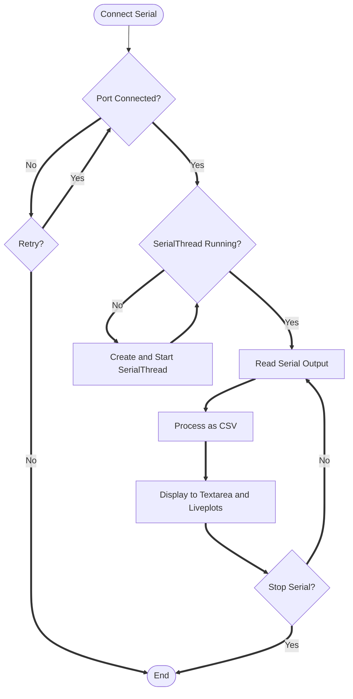
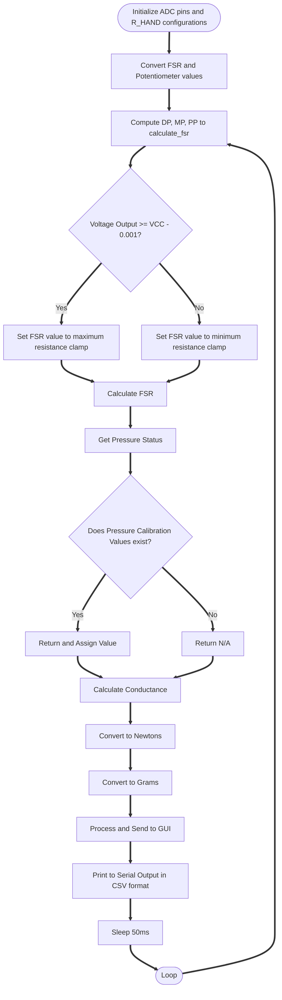
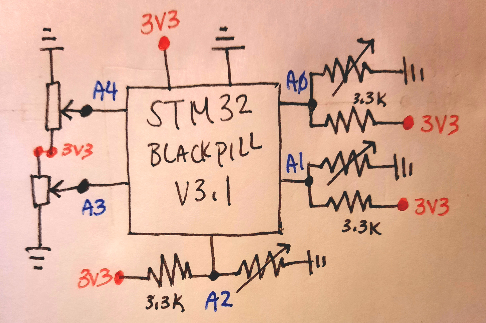
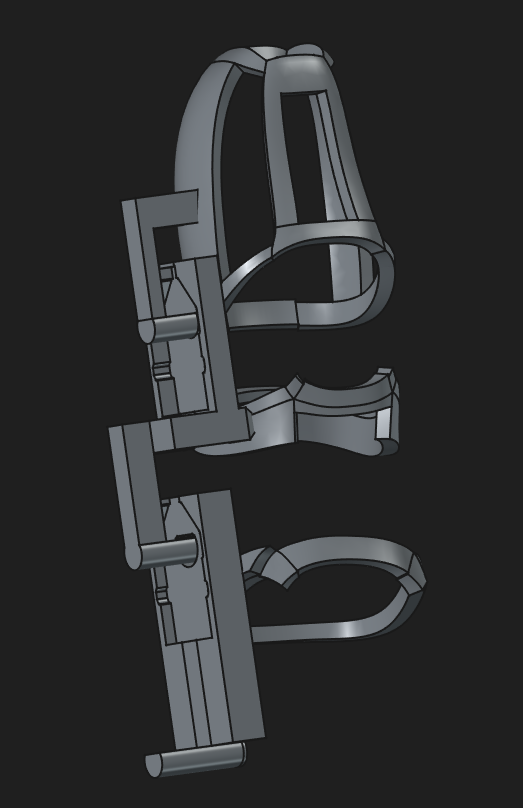
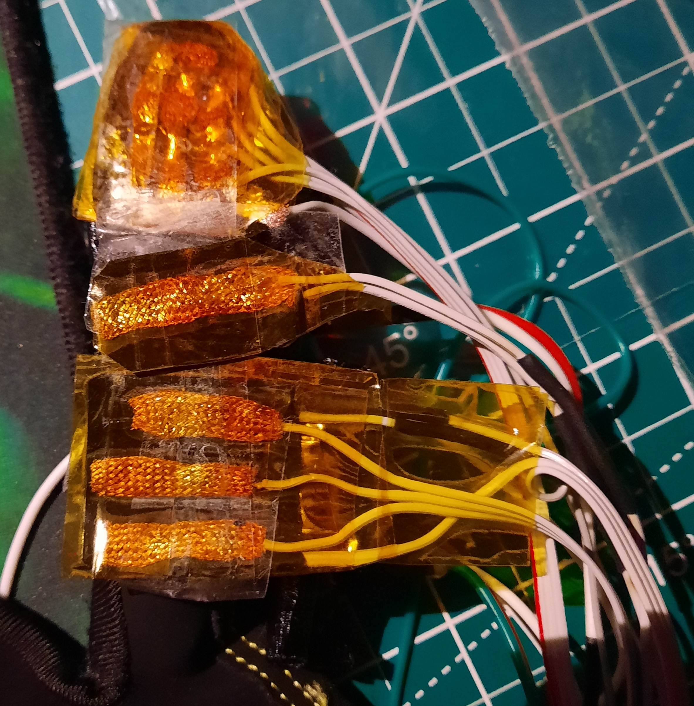
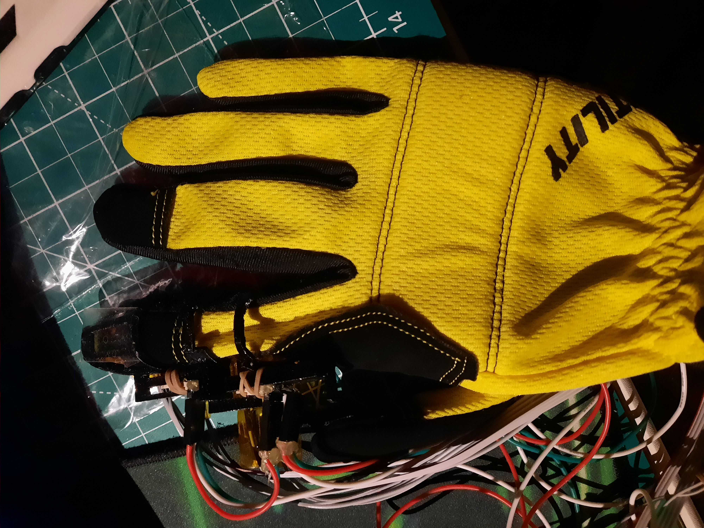

# STM32 Tactile Glove Experiment (Prototype)

An experiment first testing the **index finger** wearable prototype. This concept can be applied throughout all the fingers. 

Equipped with custom joint flex tracking with SMD potentiometers and tactile feedback with velostat and solder wick. 

### Background
An upgrade from my two previous sensor gloves, my blog posts share the continuous iteration:
* [Sensor Glove V1](https://bnzel.github.io/2024-11-13-Crude-Sensor-Glove/)
* [Sensor Glove V2](https://bnzel.github.io/2025-07-10-Sensor-Glove-V2/)

#### Features
* Custom Index Finger Cuffs.
* **Joint Flex Tracking:**
    * Dual potentiometers capturing real time rotational movement.
* **Multi Regional Force Sensing:**
    * Velostat and solder wick combination to create a **Force Sensitive Resistor** to the fingers: **[Distal Phalanges, Middle Phalanges, Proximal Phalanges](https://encrypted-tbn0.gstatic.com/images?q=tbn:ANd9GcRHGSkLx7dHIT1cJtOM-c_z-CGy0FRaNFDhyw35k0kZ--x3uN1_aN8RyC8&s=10)**.
* **Custom Dashboard:**
    * Python GUI that connects to serial output and reads incoming data to process and plots them in real time.

### Demo
https://github.com/user-attachments/assets/46218729-9e85-47b5-97d2-6f6d8990b069

https://github.com/user-attachments/assets/2a04278b-734e-488a-b526-99382673ec98

### Resources
> List of **tutorial references** are comments in **[./pyqt_gui/init.py](./pyqt_gui/__init__.py)** and **[./sensor_glove/r_hand.py](./sensor_glove/r_hand.py)**

#### Hardware
* STM32 BlackPill V3.1
* **[Bourns 33882 - 12 mm Rotary Position Sensor](https://www.digikey.ca/en/products/detail/bourns-inc/3382G-1-103G/1944266)**
* Three 3.3K Resistors
* Velostat & Solder wick
* Ribbon cables
* **[Custom 3D Printed Cuffs](./freecad/)**

#### Software
* **[FreeCAD](https://www.freecad.org/)**
* **Python:**
    * **[PyQT6](https://www.riverbankcomputing.com/software/pyqt/)** and **[PyQTGraph](https://www.pyqtgraph.org/)**
    * **[pglive](https://github.com/domarm-comat/pglive)** *pip package* for live plots
    * For both working with the GUI and microcontroller: **[requirements.txt](./pyqt_gui/requirements.txt)**

### In Depth Overview

#### How To Run
To run both the **STM32** and **GUI**, ensure you have the following:
* Python environment
* **requirements.txt**

Change to the *'[./pyqt_gui](./pyqt_gui/)'* directory and run *'[main.py](./pyqt_gui/main.py)'*.

To upload firmware or run the **STM32**:

To Upload
```
mpremote connect /dev/YOUR_PORT fs cp r_hand.py :r_hand.py
mpremote connect /dev/YOUR_PORT fs cp main.py :main.py
mpremote run main.py
```

Once the port is connected, to run: 
``` 
mpremote 
```

##### Linux or WSL
You may use these shell scripts without switching to your python environment:

##### Uploading Firmware
```bash
eval "$(YOUR_ENV shell.YOUR_SHELL hook)"
YOUR_ENV activate YOUR_PYTHON_ENV
mpremote connect /dev/YOUR_PORT fs cp r_hand.py :r_hand.py
mpremote connect /dev/YOUR_PORT fs cp main.py :main.py
mpremote run main.py
```

##### Accessing REPL
```bash
eval "$(YOUR_ENV shell.YOUR_SHELL hook)"
conda activate YOUR_PYTHON_ENV
mpremote
```


#### Flowcharts

##### Python Graphical User Interface

##### Firmware STM32 Blackpill



#### Schematic


#### Finger Cuffs
The cuffs are separated into **three parts** based on the anatomy of our fingers: 
* Distal Phalanges : DP **&rarr;** TOP
* Middle Phalanges : MP **&rarr;** MIDDLE
* Proximal Phalanges : PP **&rarr;** BOTTOM

It is already separated and placed into the **[freecad directory](./freecad/)** as **[STLs](./freecad/stls/)** and the original project file.

Each cuffs has their own potentiometer mounts where an extender arm goes through the shaft in order to create rotational movement.



#### Glove
The velostat is sandwiched between the solder wicks to create a flexible conductive electrode. There is a **[helpful tutorial that explains how to do this](https://www.youtube.com/watch?v=seMVgJ41BZw)**.

To cover as much surface area of each region, I decided to use a **3x3 matrix** layout on both **DP** and **PP**. **MP** is **1x1 matrix**. They are taped together on each region first with Kapton tape then secured to the cuffs with clear tape.




The potentiometers VCC and GND are chained while their analog pins are separately wired to the BlackPill. 


